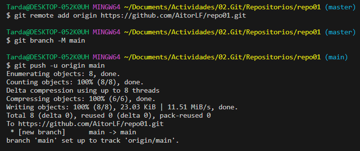
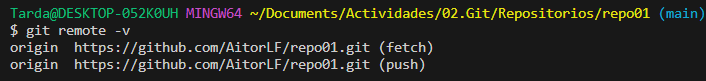
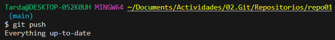

Una vez tengamos el .md creado tenems que subirlo a git con git add (nombre del fichero) o "." para subir todo lo que haya en la carpeta

Con esto ya tenemos el fichero dentro de dentro de nuestro repositorio local 

Añadimos todo con un git add. para incluir las fotos del repositorio

Ahora tocaria la parte de subir todo al repositorio pero aun nos queda indicarle a git cual es nuestro repositorio remoto
Para eso vamos a ir a Github, crearemos un nuevo repositorio con el nombre de repo01 e introduciremos las lineas de comando que nos indique githab en caso de ya tener un reposiotor creado

Con esto hecho sin problemas lo siguiente es comprobar nuestro remoto con git remote-v

Como podemos ver ya esta configurado el git remoto asi que ahora nos queda subirlo con git push

Y con esto ya estara nuestro repositorio en github