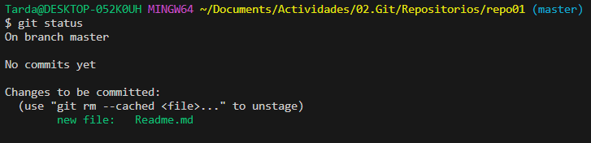
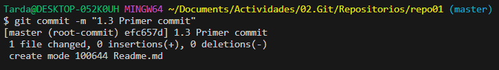

Una vez tengamos el .md creado tenems que subirlo a git con git add (nombre del fichero) o "." para subir todo lo que haya en la carpeta

Con esto ya tenemos el fichero dentro de dentro de nuestro repositorio local 

